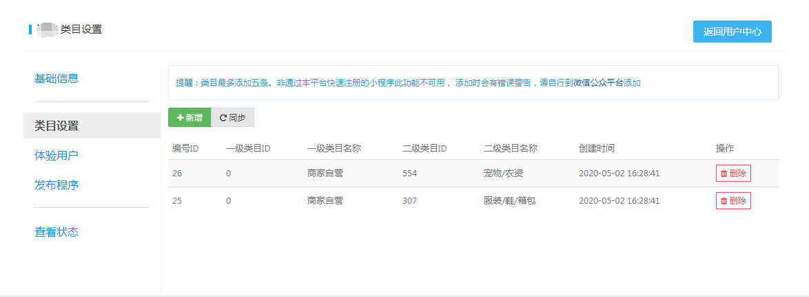
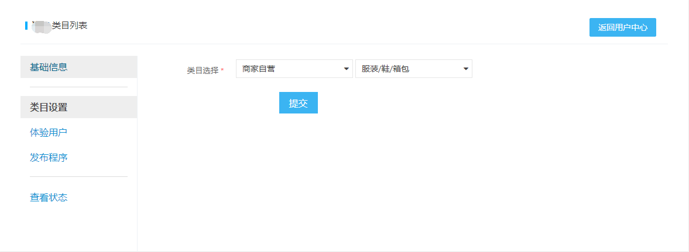
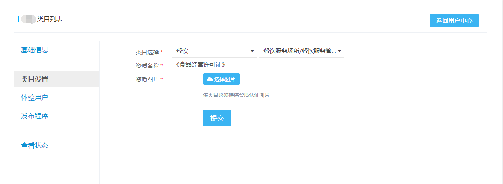

## 入口位置

- 登录后点击页面 `基础信息`

## 类目设置

- 选择左侧 `类目设置`
- 如列表内容与设置不同，可点击`同步`，刷新类目列表

## 添加类目

- 点击`新增`
- 可添加多条类目，小程序服务内容及功能需对应相关类目

!> 这里需要默认添加一个“商家自营-服装/鞋/箱包”类目，小程序推送订单状态及支付状态等订阅消息时的必要条件。

!> 如果营业类目需要特殊资料证件，需根据提示上传对应证件

