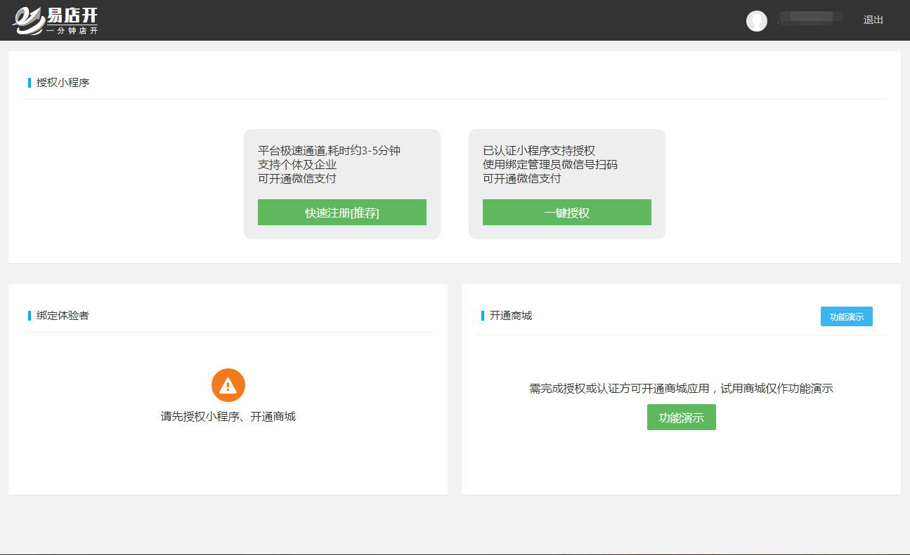
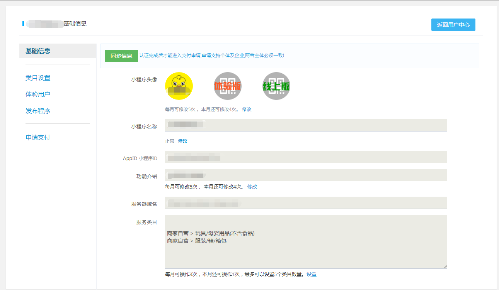
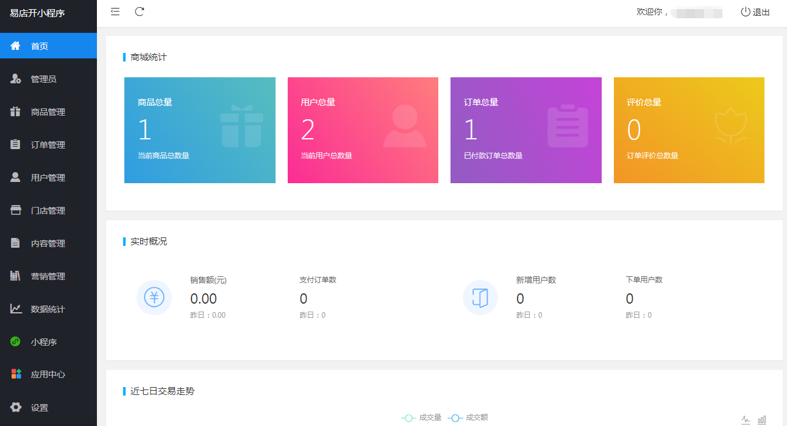

# 小程序创建与发布流程
---
## 一、创建小程序

### 无小程序帐号

点击“快速注册”，来到小程序信息提交页面，根据提示填写上传相关资质信息，完成后点击提交，支付审核费用，等待审核。

### 已有小程序帐号

点击“一键授权”，来到微信授权页，使用微信扫码选择相应的小程序后点击确定，等待授权回调。

## 二、配置小程序

### 基础信息配置

##### 1、小程序头像

点击修改，上传小程序头像，提交。

##### 2、小程序名称

- 点击“修改”，填写小程序名称，点击“检测名称”，验证名称是否可用。
- 上传与申请小程序时提交的营业执照
- 点击提交，等待审核。

##### 3、小程序功能介绍

点击修改，填写小程序提供的服务和功能。

##### 4、小程序类目设置

点击设置，添加小程序所属类目。

##### 5、添加体验用户

点击“体验用户”，添加该小程序在未发布上线前的体验用户，进行发布前测试。

## 三、开通商城

- 点击“返回用户中心”，来到用户中心首页。
- 选择线路，点击“开通”

### 商城设置

