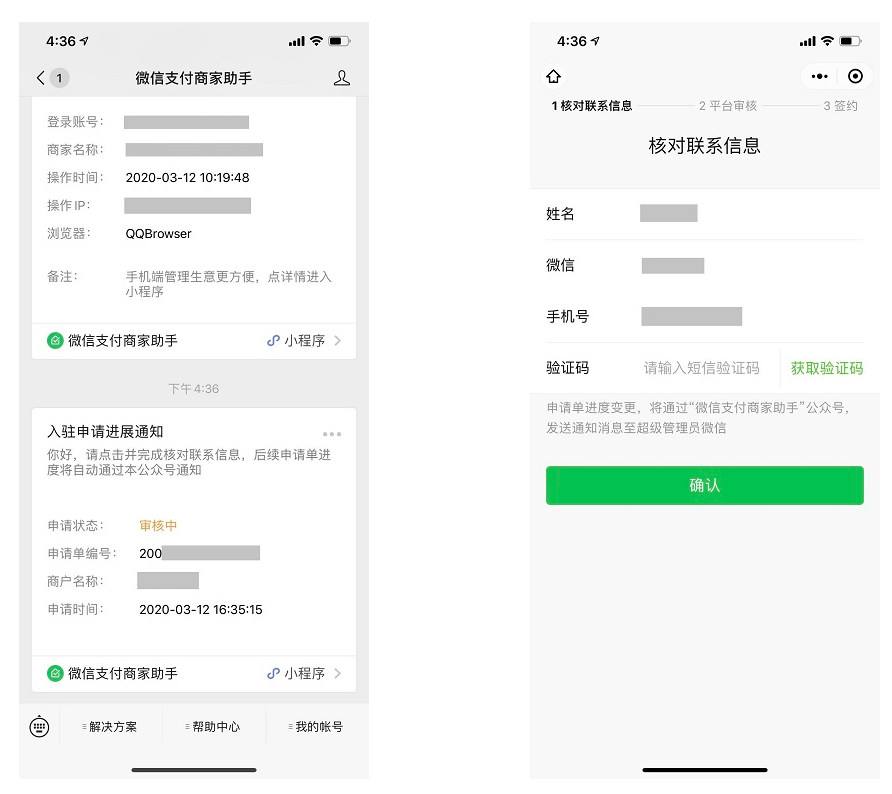
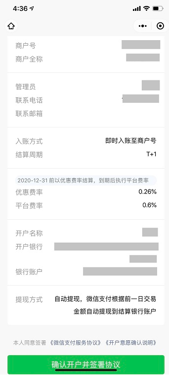

 ## 创建申请单

- 入口 基础设置 左侧支付相关菜单

- 选择个体户、企业主体；

- 填写资料包括：主体信息、经营信息、结算规则、结算账户、超级管理员。

## 核对申请单信息

- 申请提交后，回到小程序基础信息页，点击 `查看状态` 根据提示扫描二维码

- 超管微信扫码后，“微信支付商家助手”公众号发送“申请进展通知”；超管点击消息，并完成“核对联系信息”（如下图），则后续公众号自动推送申请进展给超管，指引超管操作。

## 完成签约

- 待所有验证完成后,即可进行签约（如下图）

- 签约完成后即可在小程序中使用

