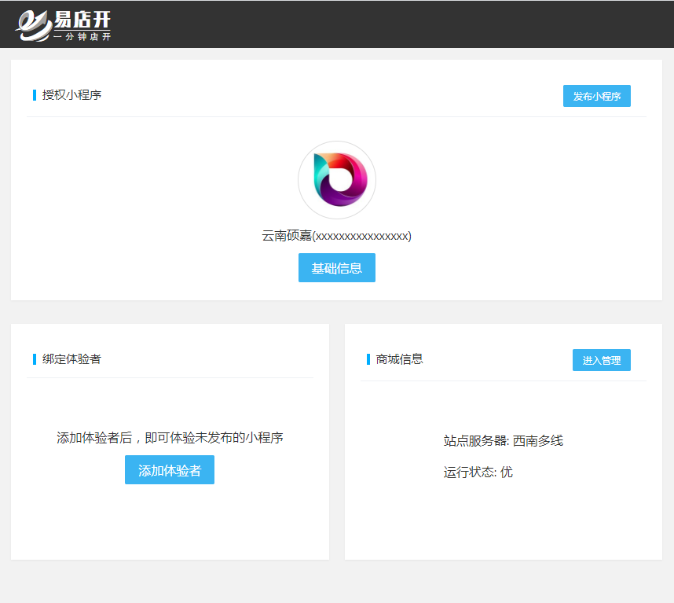
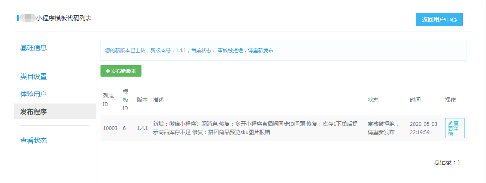
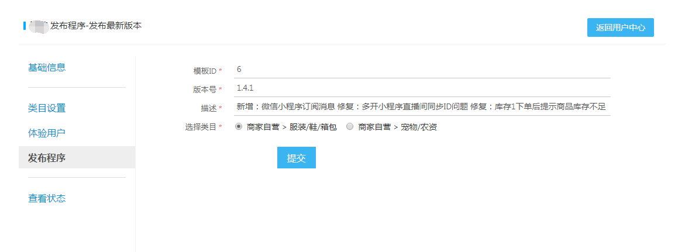

## 入口位置

- 登录后点击页面 `基础信息`

## 发布程序列表

- 选择左侧 `发布程序`
> 此处会列出发布的小程序版本列表，每次发布小程序后在此可看到是否上线成功及被驳回的驳回详情

## 发布新版本

- 点击`发布新版本`，进入`发布新版本`
- 选择小程序对应的服务类目，提交即可

!> 发布小程序前，需要先设置好 小程序名称、头像、类目、体验用户及商城内添加有效的商品信息，否则无法通过微信审核上线！

