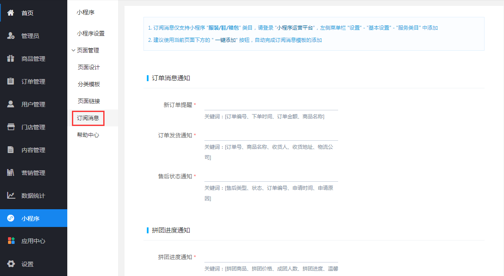
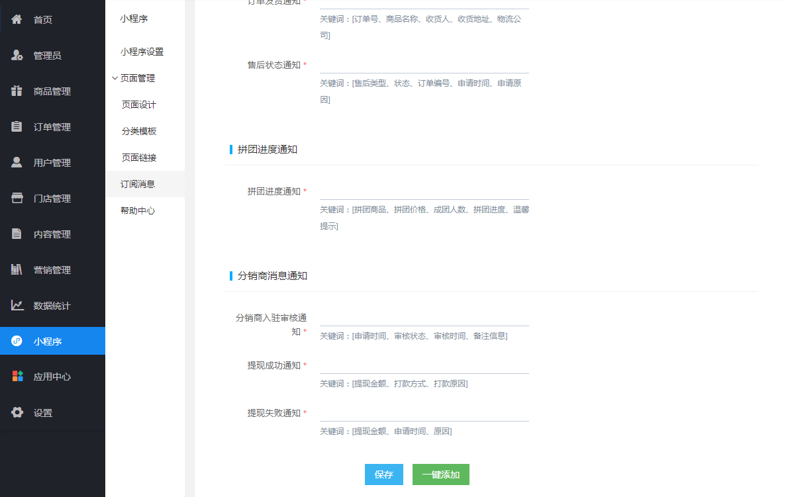
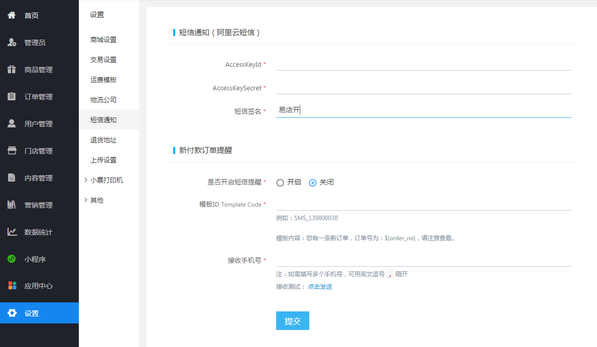

# 入口位置

> 订阅消息用于在用户微信内提醒用户订单的操作及进度，方便用户跟踪订单

- 进入商城管理后台后，点击左侧菜单“小程序-订阅消息”

## 订阅消息设置

- 页面翻到底部，点击“一键添加”，自动设置小程序订阅消息

## 短信设置

- `AccessKeyId` 、 `AccessKeySecret` 、 `短信签名` 及 `Template Code` 请联系客服获取。
- 添加10个商品后免费赠送100条短信。

