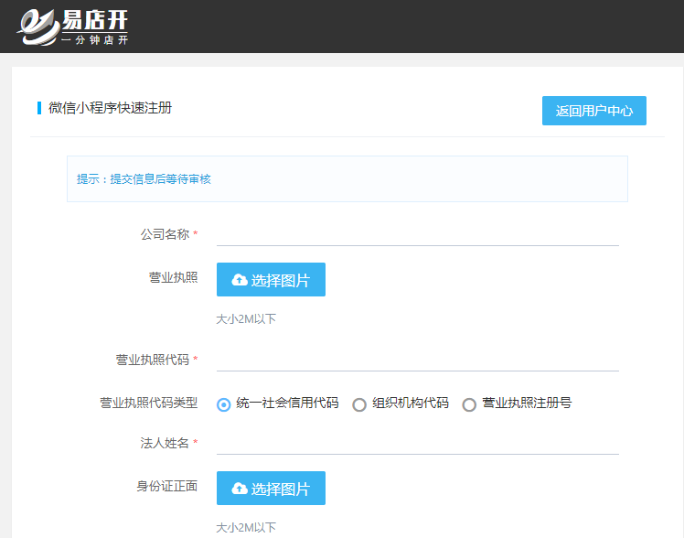
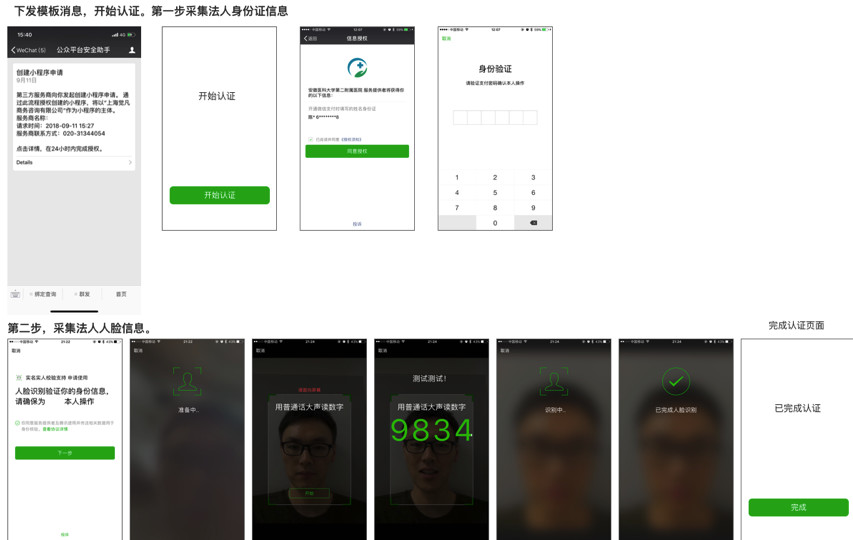

## 一、快速创建小程序[推荐]

> 仅需要提供最简单的基础信息即可完成注册

- 选择 `快速注册`

## 二、填写相关信息

- 仔细核对填入信息提交即可

- 支持个体与企业申请

!> 法人微信号需要认真填写,否则无法完成申请

## 三、等待审核

- 资料真实有效,可快速通过审核

- 法人需在24 小时内点击消息，进行身份证信息与人脸识别信息收集

- 信息收集完毕，验证通过后，即可创建已认证的小程序。

## 四、审核不通过

> 只要资料真实并即时认证 都可以快速认证,如审核不成功,请按提示修改